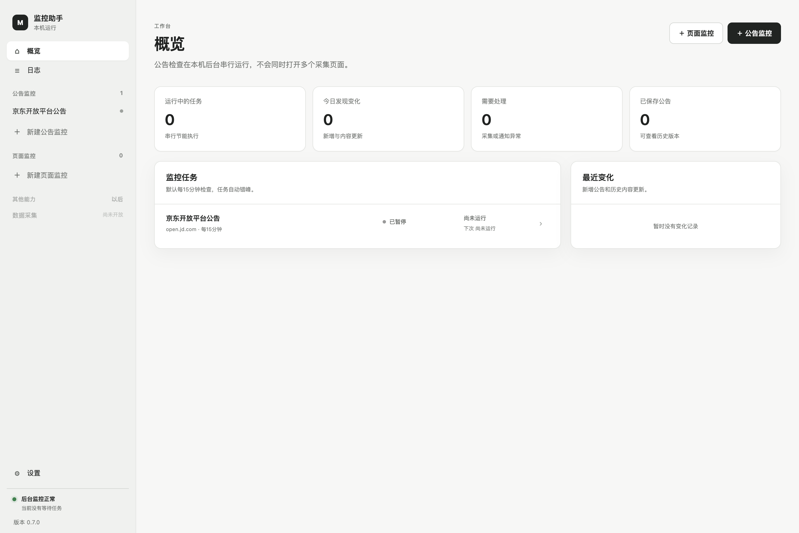
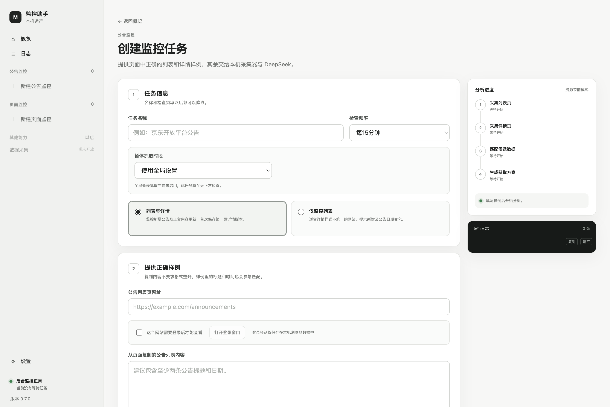
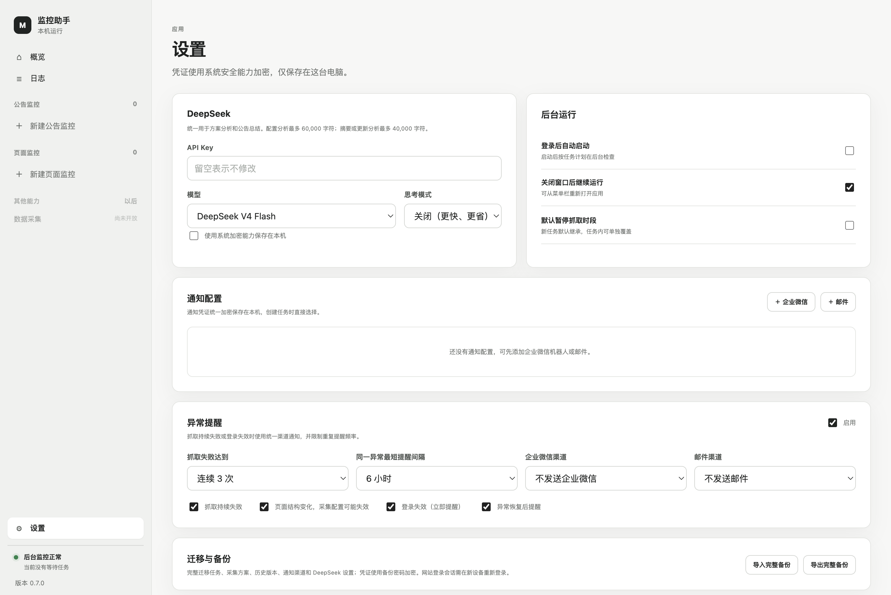

# AnnounceTrack · 监控助手

> [!WARNING]
> 本项目代码主要由 OpenAI Codex 辅助生成与迭代，仅供学习和研究。使用前请自行完整审查代码，并在隔离环境中充分测试；请勿未经评估直接用于生产环境或关键业务。使用本项目产生的任何数据丢失、服务异常、安全风险或其他后果均由使用者自行承担，项目作者及贡献者不对此承担责任。
>
> This project was primarily generated and iterated with OpenAI Codex and is provided for learning and research only. Review and test the code thoroughly before use. You assume all risks arising from its use; the authors and contributors accept no liability for resulting loss, failure, or security issues.

> 用几个正确样例，配置一个长期安静运行的网站监控任务。

AnnounceTrack 是一个本机运行的跨平台桌面工具，用来监控平台公告和指定网页区域。它会模拟浏览器访问页面，优先从 XHR / Fetch 的结构化响应中提取内容，也能处理静态 HTML；发现新增或更新后，可通过企业微信机器人和邮件通知。

不需要部署服务器。任务、Cookie、历史版本和通知凭证都留在你的电脑上。



## 为什么做这个工具

不同平台的公告页面差异很大：有的接口带签名，有的内容由 JavaScript 异步加载，有的只有静态 HTML，还有的必须登录。为每个平台手写采集脚本，维护成本很高。

AnnounceTrack 将“配置”和“日常监控”分开：创建任务时，你只需提供列表页、从页面复制的正确列表样例，以及一条详情页与正文样例。工具采集候选请求和页面区域，再让 DeepSeek 选择可复用的提取路径。保存后，日常检查完全按结构化方案在本机执行，不会每次都调用大模型。

## 主要能力

- **公告监控 · 列表与详情**：识别新增公告、日期/标题/顺序变化，并轮转复查详情正文。
- **公告监控 · 仅列表**：适合每条详情页样式不同的网站；提示新增公告和公告日期变化。
- **页面监控**：直接指定一个页面区域，内容发生事实变化时保存新版本并通知。
- **网络响应与 DOM 双通道**：支持 XHR、Fetch、JSON、JSONP、渲染后 DOM、静态 HTML、无链接列表和同页隐藏详情。
- **需要登录的网站**：在隔离窗口中完成登录，后台采集复用该网站的持久化会话；登录失效可告警。
- **历史与差异**：保存正文版本、运行记录和通知结果；更新邮件展示受限的差异片段和当前版本全文。
- **统一通知配置**：企业微信机器人和 SMTP 邮件配置可供多个任务复用，并支持预览、测试发送。
- **异常提醒**：连续抓取失败、采集配置失效、登录失效和恢复均可统一通知，并限制重复提醒频率。
- **迁移与备份**：使用密码加密导出任务、历史和全部设置；Cookie 不导出，换设备后重新登录即可。



## 通知规则

首次运行只建立基线，不会把第一页已有公告全部当作“新增”通知：

- 列表与详情模式会保存第一页每条公告的首个正文版本；暂时失败的详情会在后续轮次补齐。
- 新公告会生成 30～50 字摘要后通知。
- 已有公告的日期、标题等列表信息变化会通知，并尝试获取详情。
- 正文变化会保留新版本并生成差异摘要。只有纯标点、纯排版，或不影响事实的错别字修正可以不通知；其他变化都通知。
- 企业微信和邮件可分别选择接收新增、更新、列表变化等场景。

## 轻量运行

监控时效要求通常不高，因此资源策略优先保证电脑流畅：

- 所有任务串行执行，同一时间最多打开一个隐藏采集窗口。
- 日常监控只捕获已识别的目标请求，并屏蔽图片、字体、音视频资源。
- 单次网络响应最多保留 1.5 MB，总采集缓冲最多 24 MB；DOM 与 DeepSeek 输入也有硬上限。
- 仅列表模式不加载详情；详情审计按 24 小时均摊轮转，通常每轮只复查一条。
- 运行记录和版本数量自动清理；30 天后的原始响应和 HTML 会移除，保留可读正文。
- 界面不在每个后台进度事件上重复加载完整历史，隐藏窗口也不会持续刷新。
- 支持全局及任务级暂停抓取时段，例如每天 00:00–08:00 不检查。

## 下载与安装

发布页提供：

- **Windows 11 x64**：NSIS 安装程序；也可使用便携版 ZIP，解压后运行 `监控助手.exe`。
- **macOS Apple Silicon**：DMG 安装包。

前往 [Releases](https://github.com/vengence/AnnounceTrack/releases) 下载。当前构建未进行商业代码签名，Windows SmartScreen 或 macOS Gatekeeper 可能要求你确认来源后再运行。

## 快速开始

1. 在“设置”中填写 DeepSeek API Key，选择模型和思考模式。
2. 添加企业微信机器人或邮件通知配置，并先发送测试通知。
3. 新建公告监控或页面监控，粘贴网页 URL 与页面中复制的正确样例。
4. 分析完成后检查获取方案，并用“验证”确认列表、标题、日期和正文。
5. 保存任务。第一次检查静默建立基线，之后应用可缩到系统托盘/菜单栏运行。



## 本地开发

要求 Node.js 22+ 与 pnpm 11：

```bash
pnpm install
pnpm start
```

运行测试和构建：

```bash
pnpm test
pnpm dist       # macOS arm64 DMG
pnpm dist:win   # Windows x64 NSIS（建议在 Windows 或 CI 上执行）
pnpm dist:win:portable  # Windows x64 便携 ZIP（可在 Apple Silicon macOS 交叉构建）
```

推送到 `main` 后，GitHub Actions 会在 macOS 与 Windows 原生环境分别测试并构建安装包。推送 `v*` 标签时还会自动创建 GitHub Release。

## 数据与隐私

- DeepSeek API Key、企业微信 Webhook 和 SMTP 密码通过 Electron `safeStorage` 使用系统能力加密。
- 网站登录数据按站点保存于独立 Electron 会话；应用不会读取或保存账号密码。
- Cookie、授权头、完整请求和登录账号不会发送给 DeepSeek。
- 配置分析只发送脱敏、清洗、截断后的候选；摘要分析只发送必要正文或差异片段。
- 备份使用用户密码通过 `scrypt` 派生密钥，并以 AES-256-GCM 加密。
- 历史 HTML 在展示和邮件发送前会再次移除脚本、事件属性和危险链接。

## 当前边界

- 目标内容需要在页面打开后自动加载；暂不自动执行复杂点击、滚动或搜索。
- 验证码和登录可在独立窗口中手动完成，但强风控、特殊证书或企业代理页面仍可能无法采集。
- 网站大改版后，原采集方案可能失效；应用会在连续失败达到阈值后提醒重新配置。
- macOS 与 Windows 构建尚未使用付费开发者证书签名。

## English

AnnounceTrack is a local-first desktop monitor for platform announcements and selected web-page regions. Give it a few correct examples, let DeepSeek choose a reusable extraction plan, and keep scheduled checks local. It supports browser network interception, rendered/static DOM extraction, signed or authenticated pages through persistent browser sessions, version history, WeCom and SMTP notifications, encrypted backups, macOS, and Windows 11.

## License

[MIT](LICENSE)
